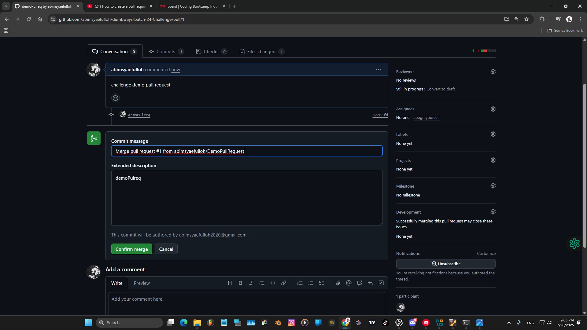

# Demokan penggunaan Pull Request
Pull Request (PR) adalah permintaan untuk menggabungkan perubahan dari satu branch ke branch lain di dalam satu repository.  
Salin Repository ke Terminal.  
  
Menggunakan command `git clone`  
  
Buka direktori yang sudah diclone, dan buat branch baru `git checkout -b DemoPullRequest`.  
  
Melakukan perubahan pada file README.md  
  
  
Commit dan push di branch baru kita ke github.  
  
Buka Repository Github.  
  
Tekan tombol `Compare & pull request`.  
  
Isi judul dan deskripsi Pull Request.  
  
Klik tombol Confirm merge.  
  
Tampilan jika sudah berhasil menyelesaikan Pull Request dari branch DemoPullRequest ke main.  
  
