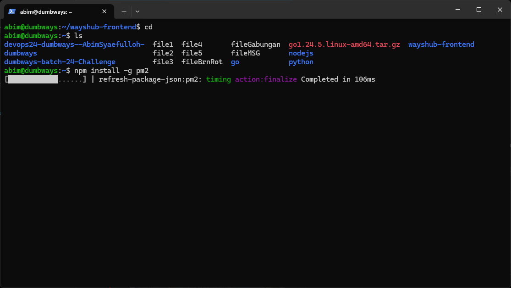
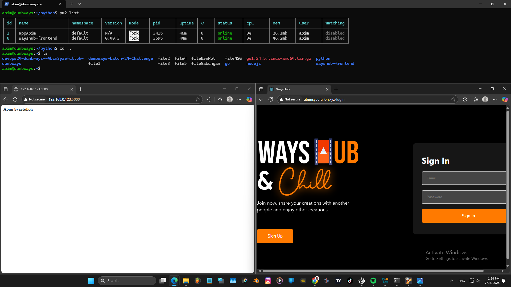

# NodeJS + Python berjalan di background (tanpa kondisi attached di terminal)
Disini saya akan menggunakan Alat/Tool bernama pm2.  
Apa itu pm2, pm2 (proses manager 2) adalah alat untuk menjalankan, memantau, dan mengelola aplikasi yang berjalan di background (background process manager).  
### Langkah - Langkah
Instal pm2 terlebih dahulu diterminal.  
`npm install -g pm2`  
  
### Untuk mengoprasikannya
1. Menjalankan Appnya:  
`pm2 start npm --name wayshub-frontend -- start`  
`pm2 start appAbim.py -- nama appAbim --interpreter python3`
2. Stop (hentikan sementara):  
`pm2 stop wayshub-frontend`  
`pm2 stop appAbim`
3. Start:  
`pm2 start wayshub-frontend`  
`pm2 start appAbim`
4. Restart aplikasi dengan cepat jika ada perubahan:  
`pm2 restart wayshub-frontend`  
`pm2 restart appAbim`
5. Melihat Daftar Proses:  
`pm2 list`  
6. Hapus Aplikasi dari PM2  
`pm2 delete wayshub-frontend`  
`pm2 delete appAbim`  

### Lalu jalankan NodeJS (wayshub-frontend) dan Python (appAbim.py) secara bersama.
   
