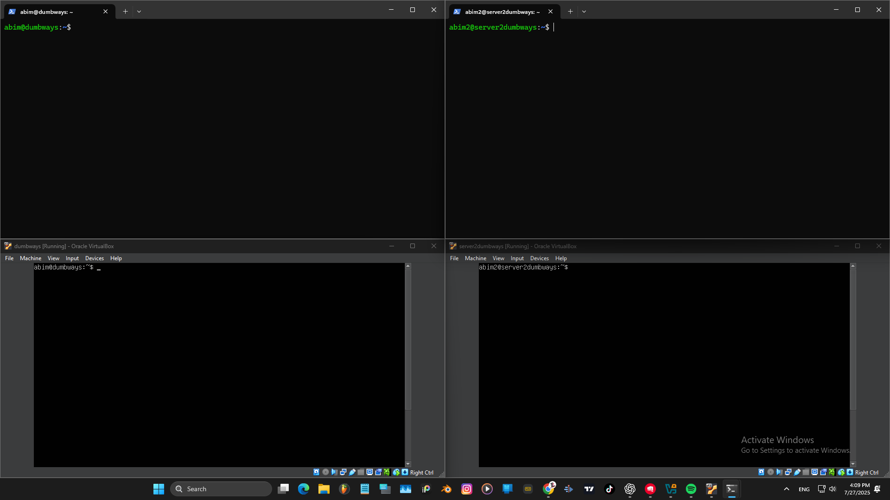
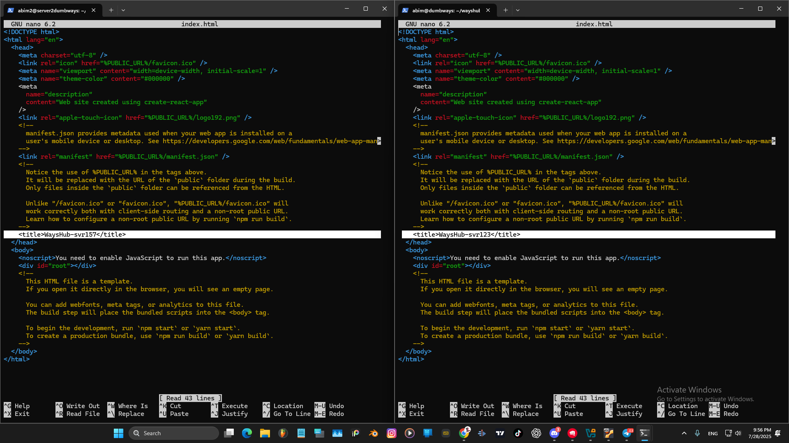
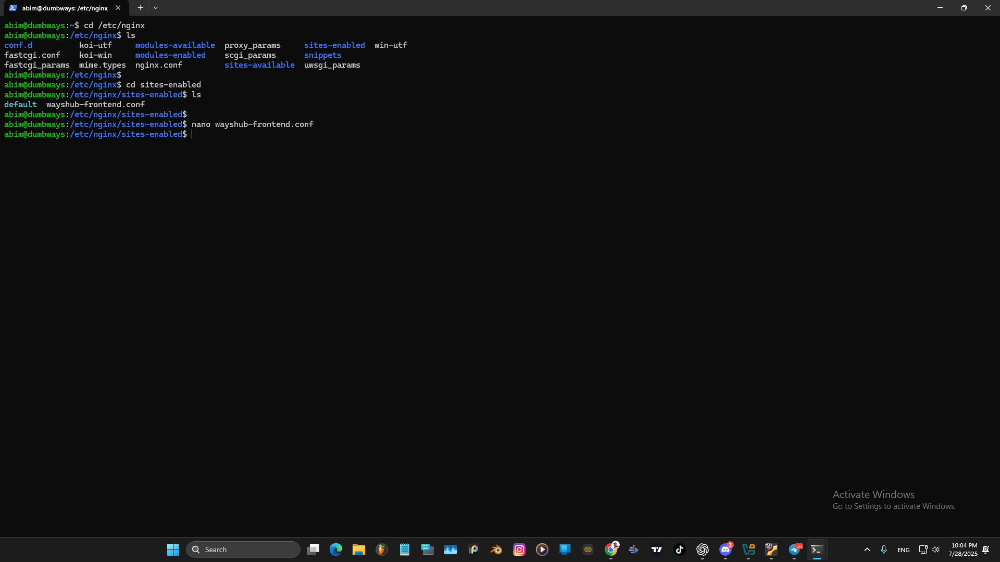
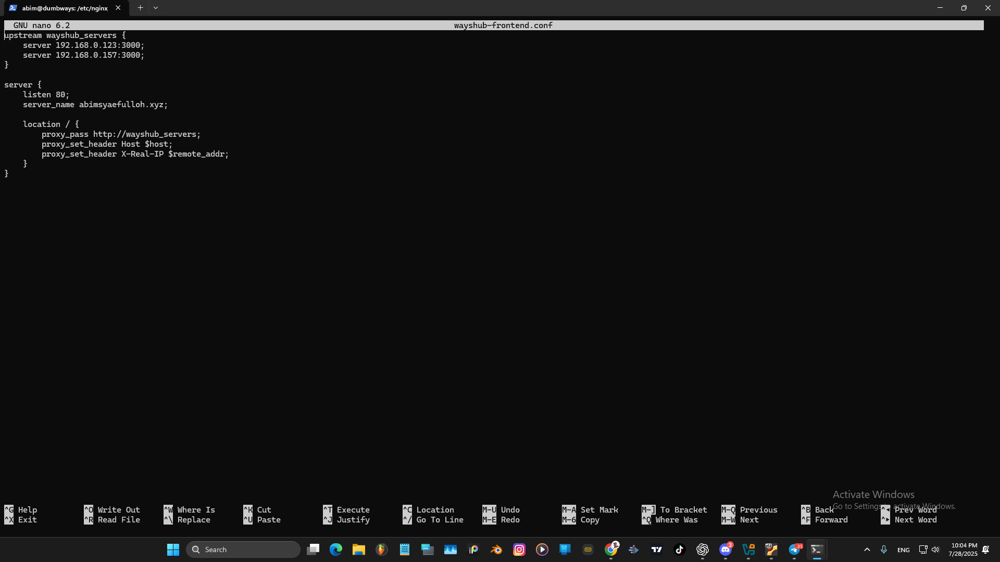

# Implementasikan load balancing kepada aplikasi wayshub. (Gunakan 2 server)  
Disini saya menggunakan 2 server yang sudah file wayshubnya di masing-masing server.  
- `server 1 (192.168.0.123)`  
- `server 2 (192.168.0.157)`  
  
Tambahkan Penanda di Tiap Server, disini saya merename titlenya yaitu:  
- Server 1 `<title>WaysHub-svr123</title>`
- Server 2 `<title>WaysHub-svr157</title>`  
  
Konfigurasi Load Balancer Nginx hanya dilakukan di salah satu server, 
yaitu server yang berperan sebagai gateway atau host utama. Server ini akan menerima semua request dari client, 
lalu mendistribusikannya ke dua backend server menggunakan teknik load balancing.  
  
   
 

