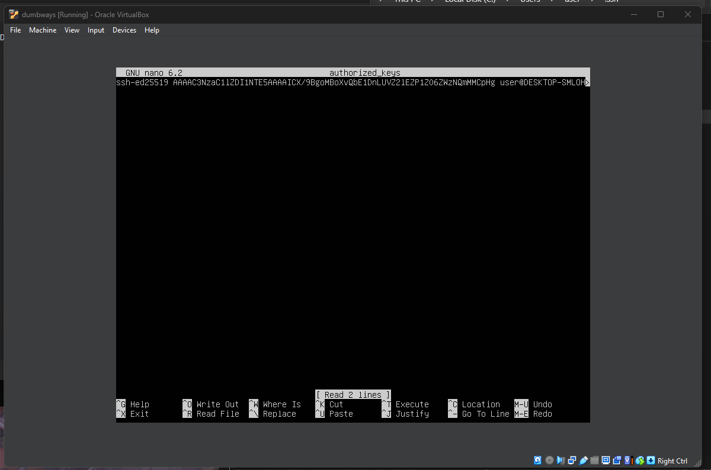
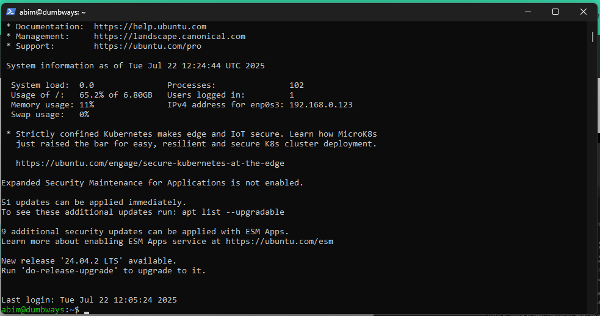

## Akses Server DiTerminal Tanpa Password

### 1. Generate Kunci dan Gembok

generate kunci dan gembok menggunakan  
`ssh-keygen`

### 2. Buka File Manager

Buka file `kunci.pub` menggunakan notepad

### 3. Tampilan di notepad

copy kuncinya yang berupa text tersebut

### 4. Copy kunci ke Server

Copy ke  
`/.ssh/authorized_keys`  

### 5. Buka authorized_keys

Buka menggunakan command  
`nano authorized_keys`  

### 6. Akses Server diterminal tampa password

### 7. Tampilan kalau sudah berhasil

