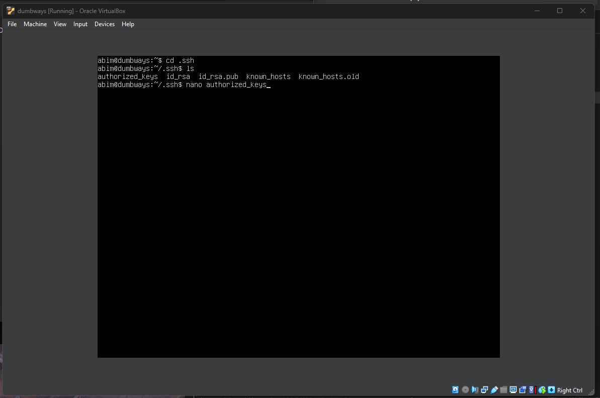

## Akses Server DiTerminal Tanpa Password.

### 1. Generate Kunci dan Gembok.

Generate kunci dan gembok menggunakan.  
`ssh-keygen`  
Lalu pilih lokasi penyimpanan.  

### 2. Buka File Manager.  
Buka lokasi penyimpanan kuncinya lalu,  
buka file `kunci.pub` menggunakan notepad.

### 3. Tampilan di notepad.

Copy kuncinya yang berupa text tersebut. 

### 4. Copy kunci ke Server.
Buka direktori dibawah ini terlebih dahulu.   
`/.ssh/authorized_keys`  

### 5. Buka authorized_keys dan Paste kuncinya.  

Buka menggunakan command.  
`nano authorized_keys`  
Lalu paste kuncinya.

### 6. Akses Server diterminal tanpa password.  
`ssh -i .ssh\kunci username@ip-address`  

### 7. Tampilan kalau sudah berhasil.

