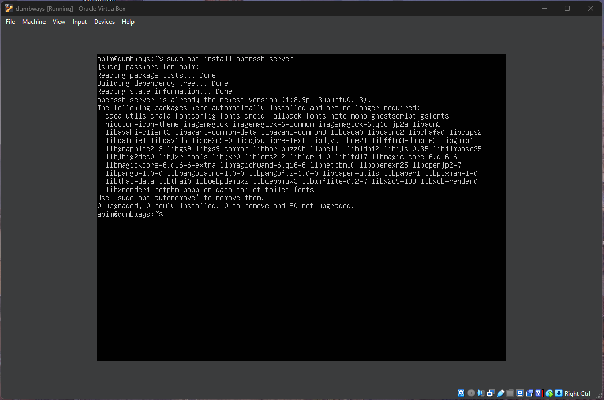
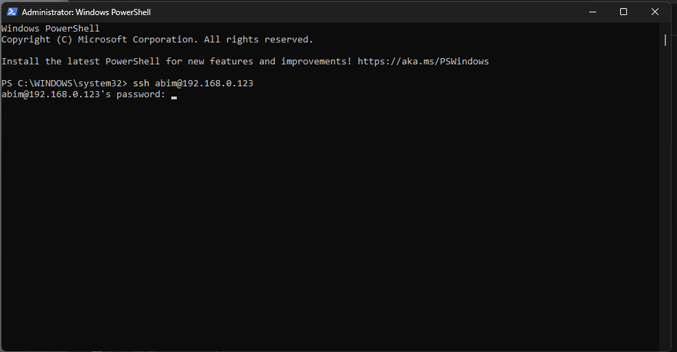
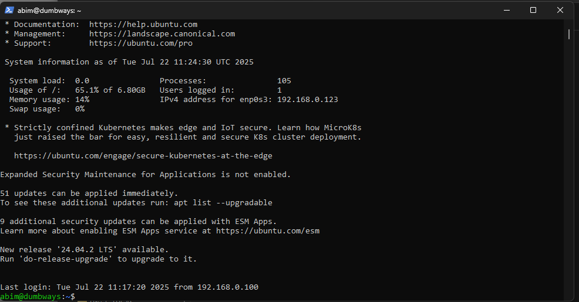

# Akses Server Menggunakan Terminal
## Buka Server VM
Install open shh  server terlebih dahulu

## Buka Terminal
Di sini saya menggunakan **Windows PowerShell** untuk mengakses server.

## Jalankan Perintah SSH
Gunakan perintah berikut untuk mengakses server:
ssh username@ip-address
Setelah itu, masukkan **password** dari server kalian.

## Sukses Terhubung
Jika berhasil, akan muncul output di terminal seperti contoh berikut:

