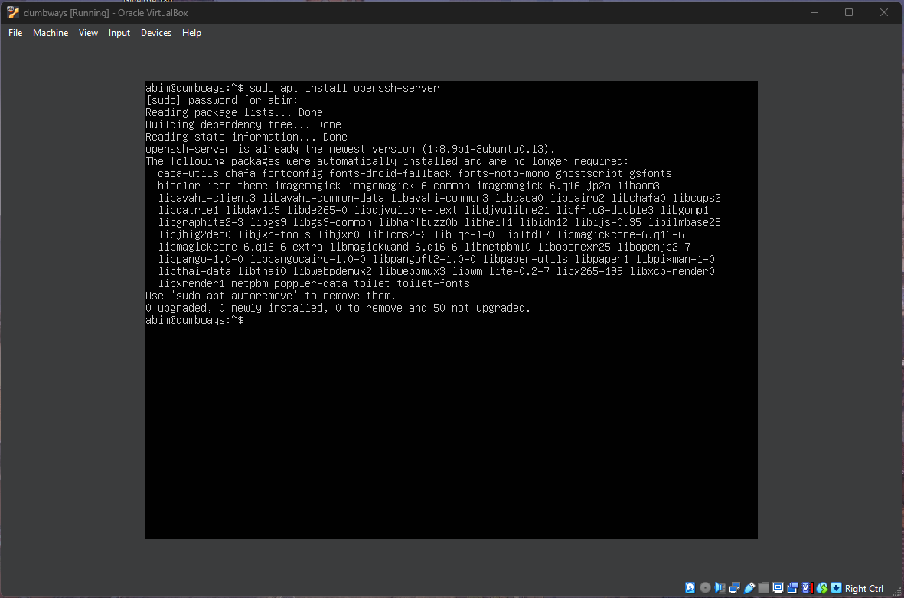
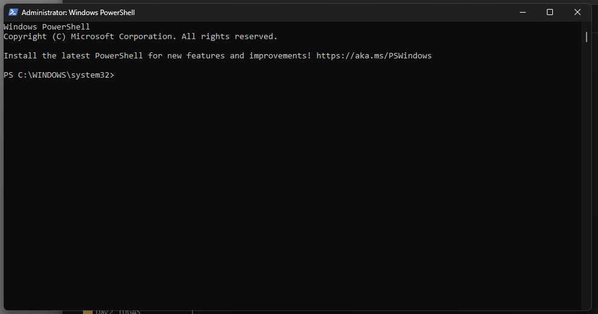
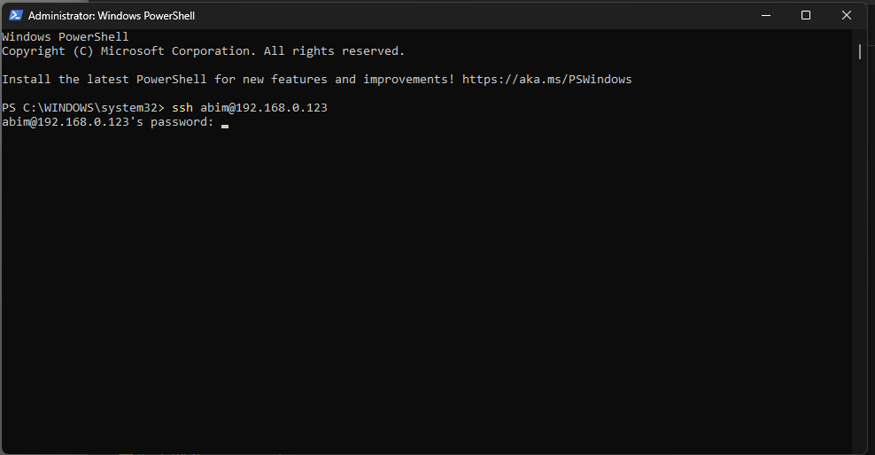
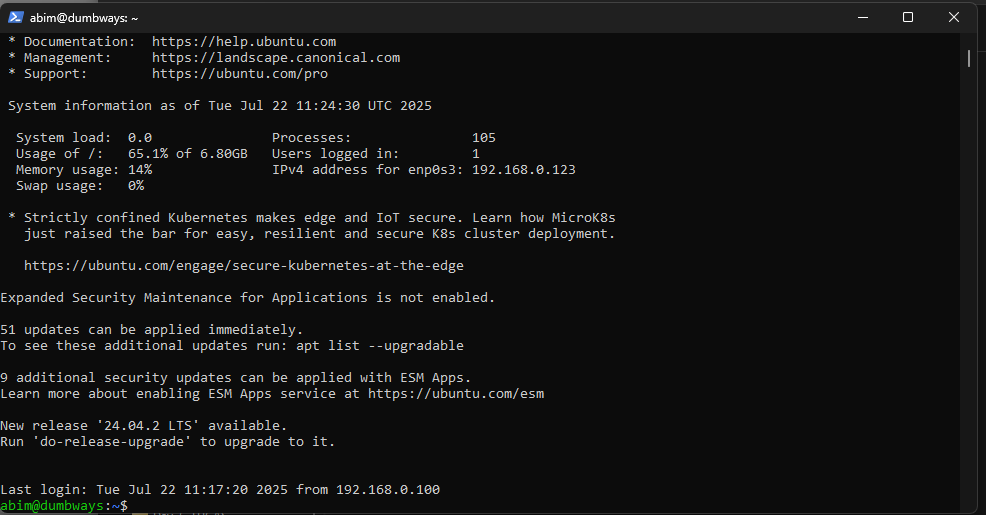

# Akses Server Menggunakan Terminal
## 1. Buka Server VM
Install open shh  server terlebih dahulu

## 2. Buka Terminal
Di sini saya menggunakan **Windows PowerShell** untuk mengakses server.

## 3. Jalankan Perintah SSH
Gunakan perintah berikut untuk mengakses server:  
`ssh username@ip-address`  
Setelah itu, masukkan **password** dari server kalian.

## 4. Sukses Terhubung
Jika berhasil, akan muncul output di terminal seperti contoh berikut:

