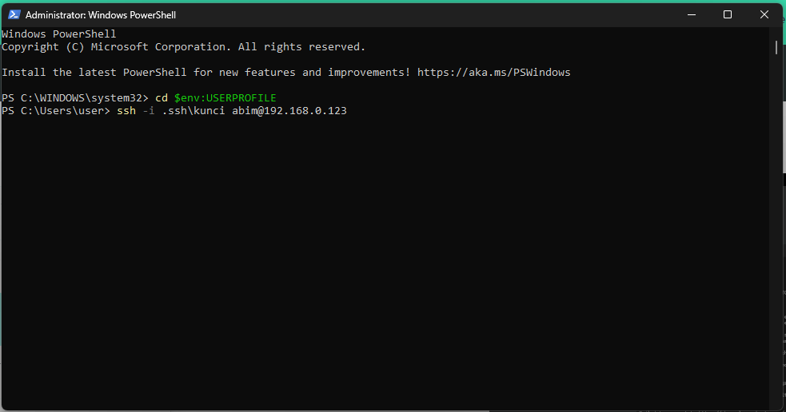

## Akses Server DiTerminal Tanpa Password

### Generate Kunci dan Gembok

generate kunci dan gembok menggunakan ssh-keygen

### Buka File Manager

Buka file kunci.pub menggunakan notepad

### Tampilan di notepad

copy kuncinya yang berupa text tersebut

### Copy kunci ke Server

Copy ke /.ssh/authorized_keys

### Buka authorized_keys

Buka menggunakan command nano

### Akses Server diterminal tampa password

### Tampilan kalau sudah berhasil

