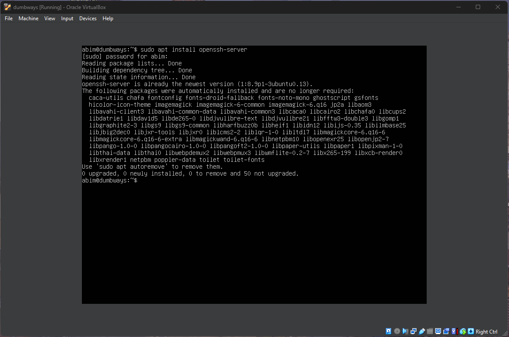
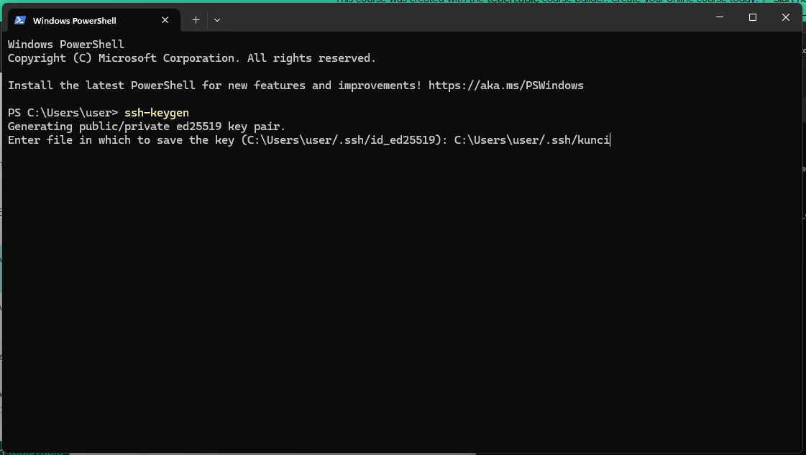
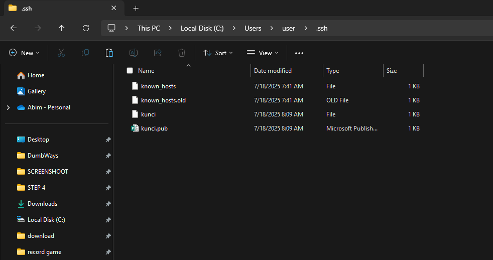
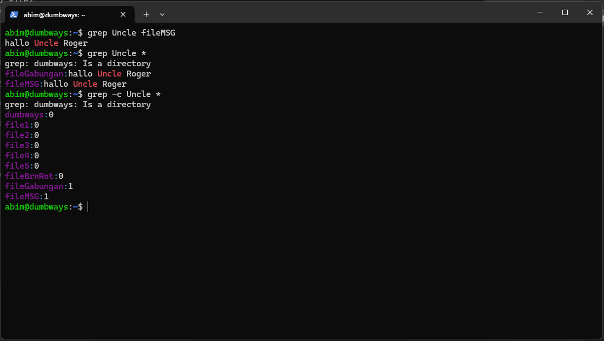

# Akses Server Menggunakan Terminal
## 1. Buka Server VM
Install open shh  server terlebih dahulu:  
`sudo apt install openssh-server`  

## 2. Buka Terminal
Di sini saya menggunakan **Windows PowerShell** untuk mengakses server.

## 3. Jalankan Perintah SSH
Gunakan perintah berikut untuk mengakses server:  
`ssh username@ip-address`  
Setelah itu, masukkan **password** dari server kalian.

## 4. Sukses Terhubung
Jika berhasil, akan muncul output di terminal seperti contoh berikut:
  

# Akses Server DiTerminal Tanpa Password.
### 1. Generate Kunci dan Gembok.

Generate kunci dan gembok menggunakan.  
`ssh-keygen`  
Lalu pilih lokasi penyimpanan.  

### 2. Buka File Manager.  
Buka lokasi penyimpanan kuncinya lalu,  
buka file `kunci.pub` menggunakan notepad.

### 3. Tampilan di notepad.

Copy kuncinya yang berupa text tersebut. 

### 4. Copy kunci ke Server.
Buka direktori dibawah ini terlebih dahulu.   
`/.ssh/authorized_keys`  

### 5. Buka authorized_keys dan Paste kuncinya.  

Buka menggunakan command.  
`nano authorized_keys`  
Lalu paste kuncinya.

### 6. Akses Server diterminal tanpa password.  
`ssh -i .ssh\kunci username@ip-address`  

### 7. Tampilan kalau sudah berhasil.

  

# Nyalakan akses port 22, 80, 443, 3000, 5000, 6969.
Dengan menggunakan command
- `sudo ufw allow 22`
- `sudo ufw allow 80`
- `sudo ufw allow 443`
- `sudo ufw allow 3000`
- `sudo ufw allow 5000`
- `sudo ufw allow 6969`

Mengecek Status port yang sudah dinyalakan
- `sudo ufw status`

# Penggunaan text manipulation - car, echo, grep, dan sed

### 1. cat
Untuk menampilkan isi file teks dan menggabungkan beberapa file.  
Contohnya:
- Menampilkan isi file: fileMSG dan fileBrnRot  
  `cat fileMSG`  
  `cat fileBrnRot`

- Menggabungkan file: fileMSG dan fileBrnRot kedalam file baru bernama fileGabungan  
  `cat fileMSG fileBrnRot > fileGabungan`

## 2. echo
Perintah echo digunakan untuk mencetak teks dan menulis text ke file yang ada diterminal  
Contohnya:  
- Mencetak text  
`echo "hallo Uncle Roger"`  
`echo "Tung Tung Sahur"`  
- Menulis text ke file  
`echo "hallo Uncle Roger" > fileMSG`  
`echo "Tung Tung Sahur" > fileBrnRot`  

## 3. grep
Mencari text dari file tertentu.  
Contohnya:  
- Mencari text **Uncle** difile **fileMSG**  
`grep Uncle fileMSG`  
- Mencari text **Uncle** di suatu direktori  
`grep Uncle *`  
- Mencari ada bebera text **Uncle** yang ada dalam satu direktori  
`grep -c Uncle *`  

## 4. sed  
Digunakan untuk find & replace, hapus baris, atau manipulasi lainnya.  
Tapi sebagai contoh singkat saya hanya akan mempraktekan `-i` saja.  
Contohnya:  
- Mengganti kata **wasupp** menjadi **Hallo** di file1.  
`sed -i 's/wasupp/Hallo/g' file1`  

