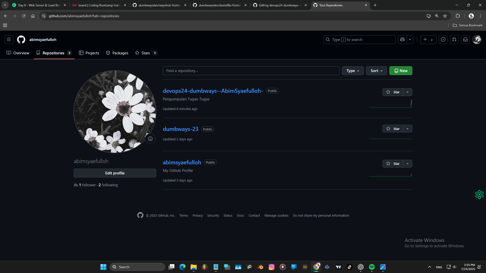
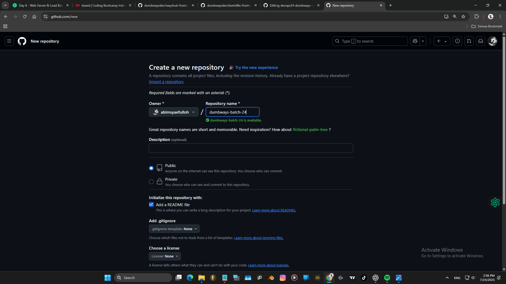
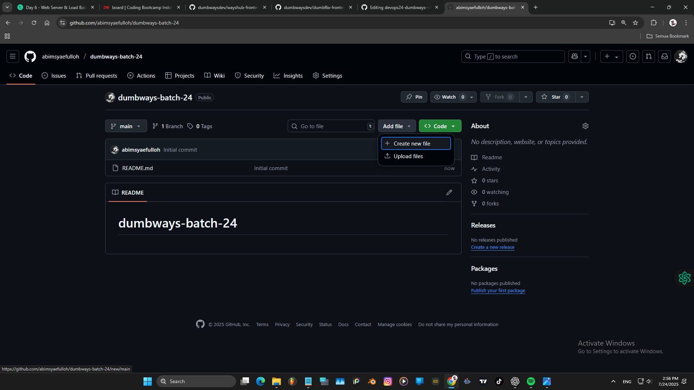
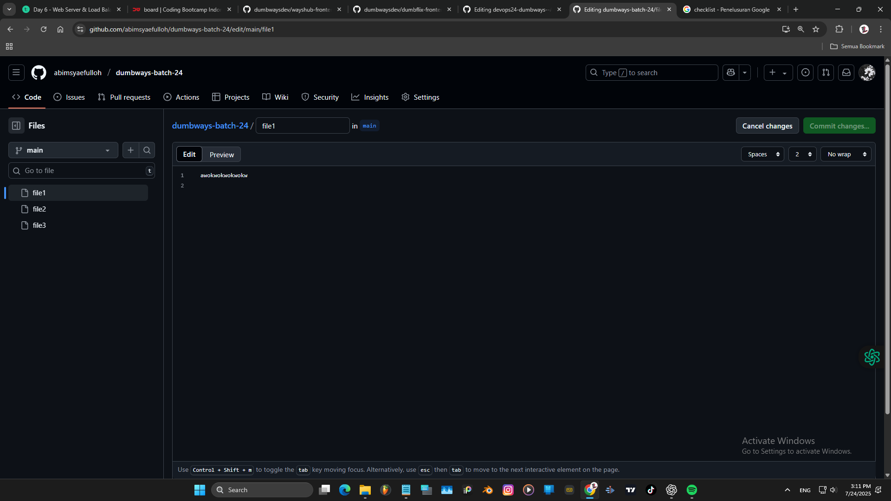
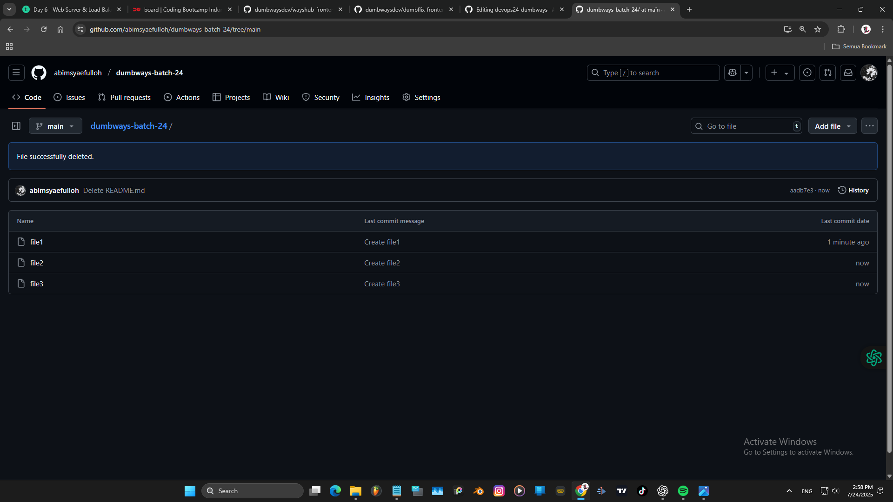

# Apa itu Git?
Git adalah sebuah version control system,  
apa itu version control system adalah alat/software yang digunakan untuk:  
- Mencatat, mengatur, dan melacak setiap perubahan yang dibuat.  
- Kembali ke versi sebelumnya kalau terjadi error.  
- Kerja bareng tim tanpa file tabrakan.  

# Membuat repository "dumbways-batch-24" dan membuat 3 file berisi text. 
Buka menu repositories diGithub dan tekan tombol  
`NEW`
  
Buat nama repository
`dumbways-batch-24`  
Pilih `Public` agar orang lain dapat melihat repository kita.  
Checklist bagian `Add a README file` untuk menambahkan file README.md secara otomatis.  
  
Tampilan awal kalau sudah jadi, lalu `+ Create new file` untuk membuat file baru.  
  
Isi nama file dan isi textnya.  
  
Membuat 3 file yang berisi text.  
  
