# Apa itu Git?
Git adalah sebuah version control system,  
apa itu version control system adalah alat/software yang digunakan untuk:  
- Mencatat, mengatur, dan melacak setiap perubahan yang dibuat.  
- Kembali ke versi sebelumnya kalau terjadi error.  
- Kerja bareng tim tanpa file tabrakan.  

# Membuat repository "dumbways-batch-24" dan membuat 3 file berisi text. 
Buka menu repositories diGithub dan tekan tombol `NEW`  
  
Buat nama repository
`dumbways-batch-24`  
Pilih `Public` agar orang lain dapat melihat repository kita.  
Checklist bagian `Add a README file` untuk menambahkan file README.md secara otomatis.  
  
Tampilan awal kalau sudah jadi, lalu `+ Create new file` untuk membuat file baru.  
  
Isi nama file dan isi textnya.  
  
Membuat 3 file yang berisi text.  
  

# Manage repository tugas (devops24-dumbways-AbimSyaefulloh) menggunakan terminal  
Buka repository yang akan dimanage di terminal, lalu salin url nya.  
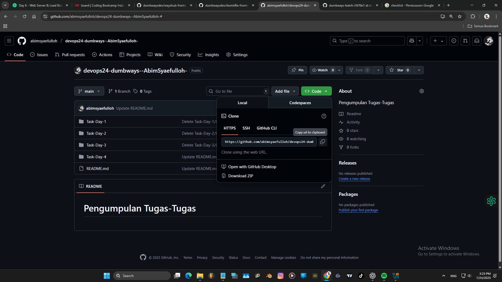  
Buka terminal lalu jalankan command `git clone` dan paste url nya.  
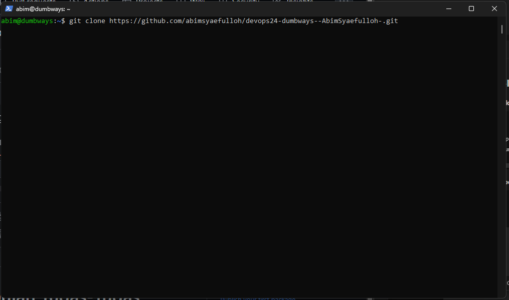  
Tapilan kalau berhasil dan periksa isi repositorynya.  
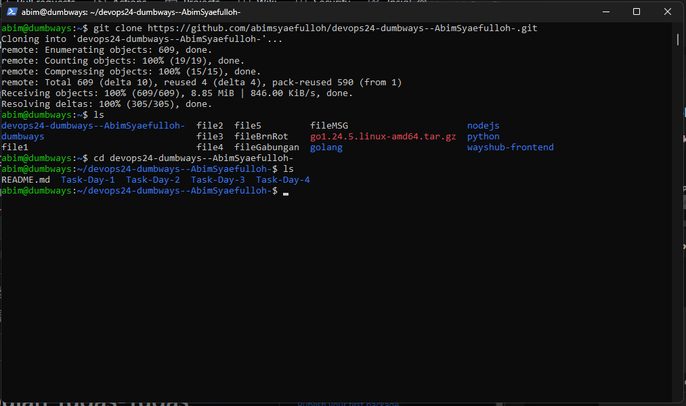  
Di sini saya coba membuat file `fileAbim` dan mengisinya dengan text `Hallo Abim`  
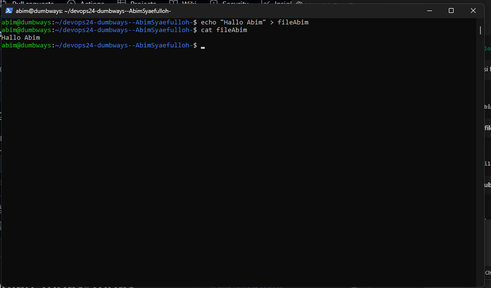  
Lalu Push ke Github kita.  
`git add fileAbim` = menambahkan fileAbim untuk diPush ke github.  
`git commit -m "NamaCommitNya"`= command untuk commitnya, untuk menyimpan catatan/pesan perubahan.  
`git remote set-url origin git@github.com:abimsyaefulloh/devops24-dumbways--AbimSyaefulloh-.git` =  
untuk mengelola alamat remote repository GitHub dari HTTPS (login username + token) menjadi SSH (gak butuh login).  
`git push origin main` = untuk push ke Github dan memilih branchenya di main  
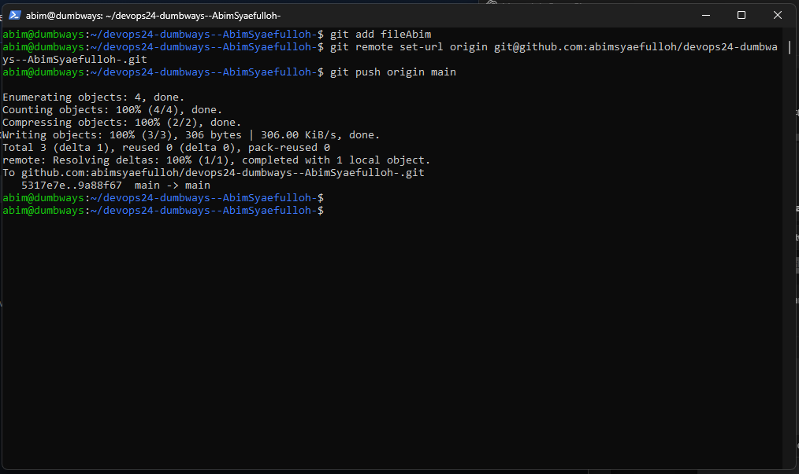  
Cek diGithub kita apakan sudah terupload.  
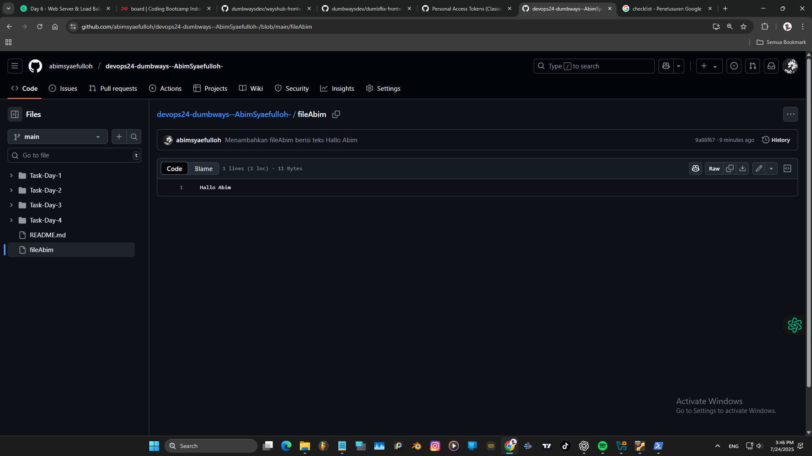  

# Demonstrasi mencari perubahan text pada suatu file di GitHub
Membuka direktory yang sudah di clone sebelumnya,  
dan jalankan perintah `git pull origin master` untuk mengupdate isi direktory kita.
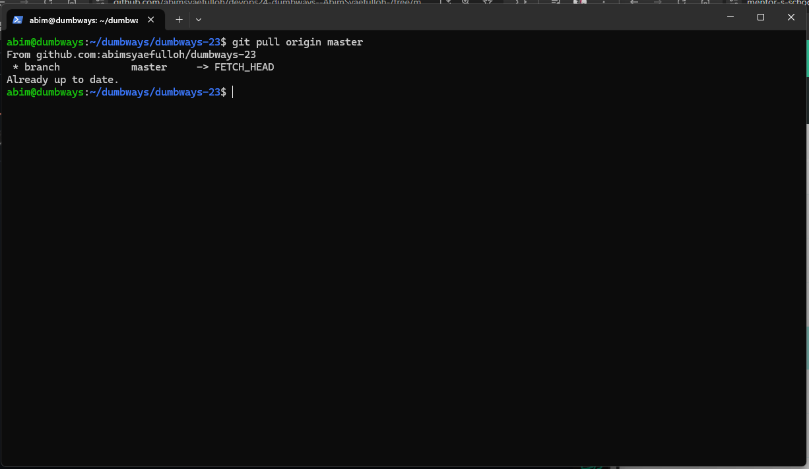  
Edit text yang ada di file1.  
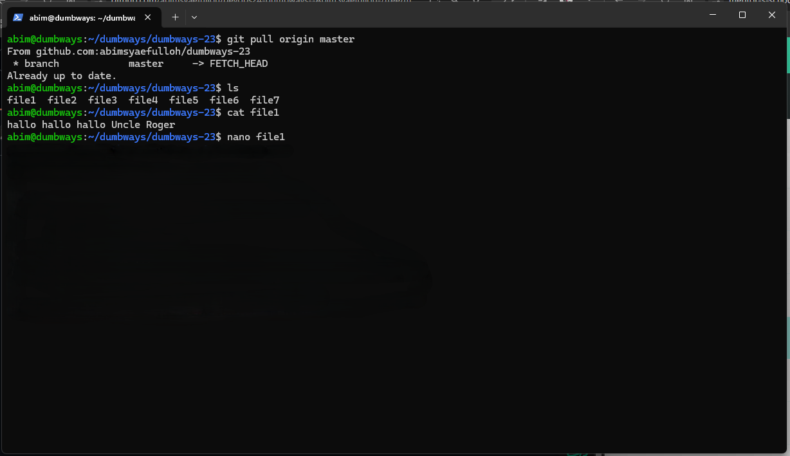  
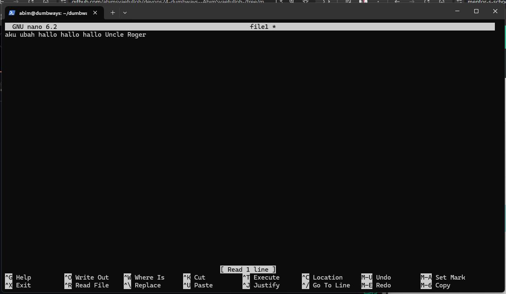  
Cek perubahan menggunakan `git status`.  
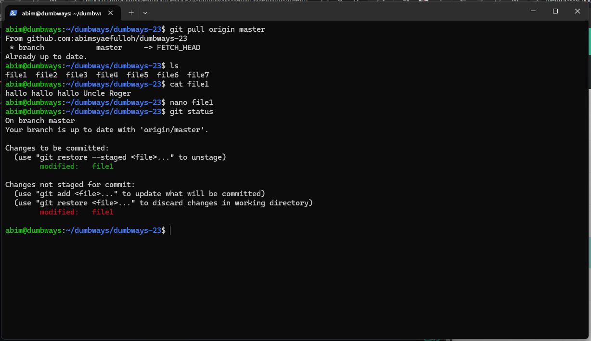  
Memasukkan file `file1` ke dalam staging area — yaitu persiapan sebelum di-commit ke dalam riwayat Git.
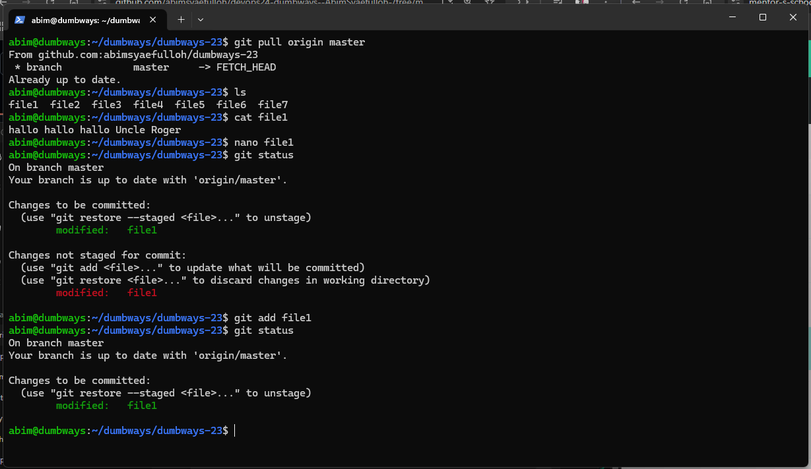  
Menyimpan pesan tentang perubahan yang sudah ada di staging, dengan pesan commit "2nd commit".  
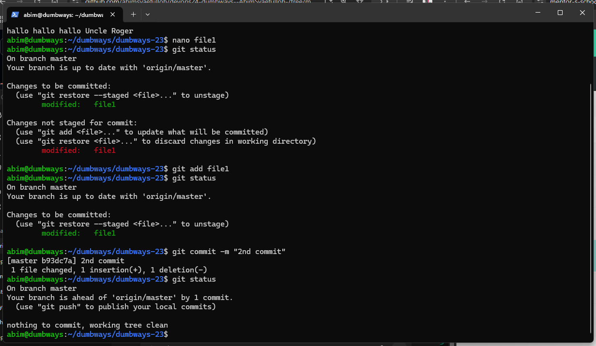  
lalu git status lagi, untuk mengecek perubahan.  
  

