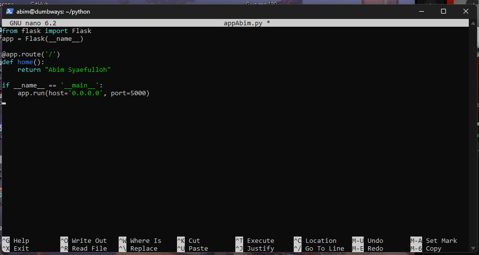
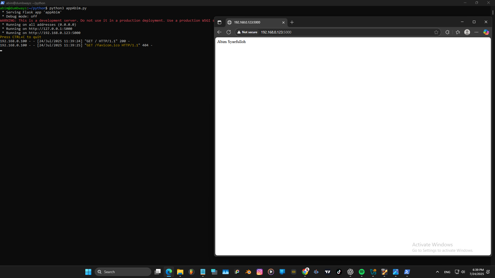
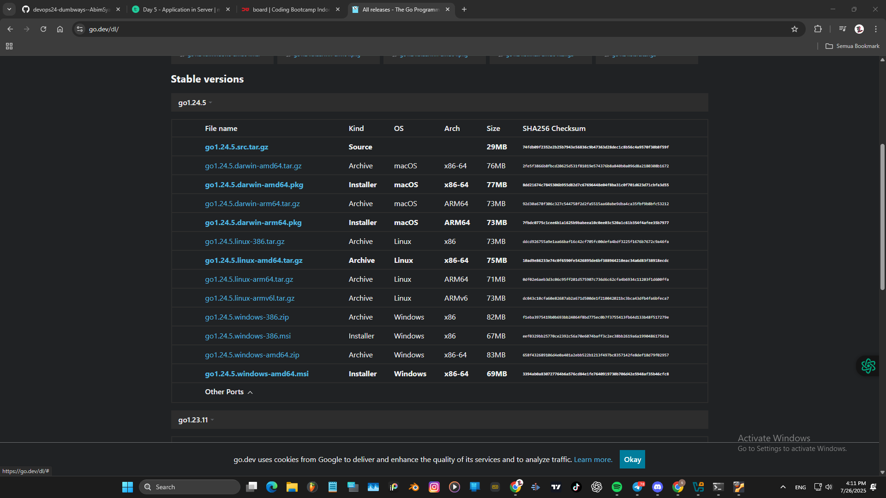
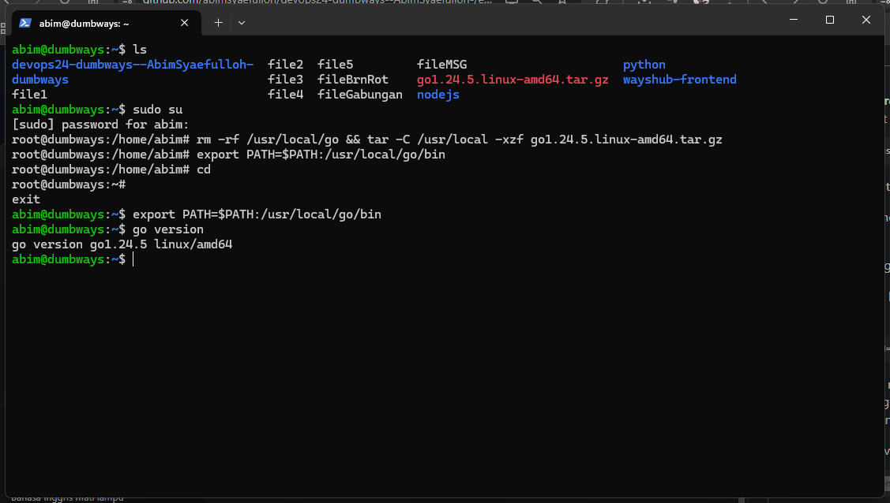
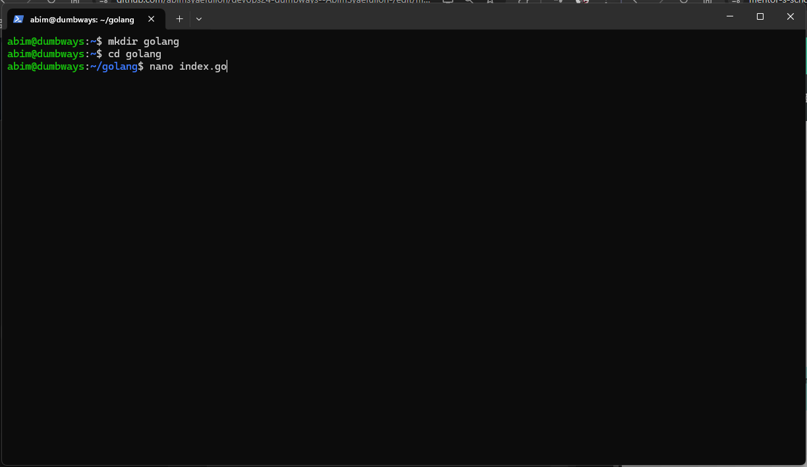
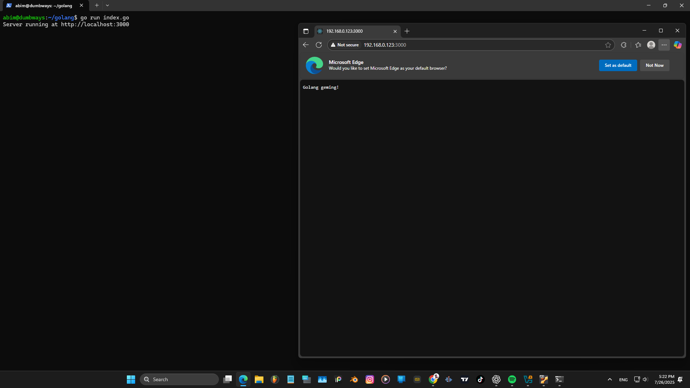

# NodeJS  
Clone Repository terlebih dahulu, dengan tekan tombol `<> CODE`, lalu salin urlnya.  
  
Jalankan command git clone dan paste urlnya  
`git clone https://github.com/dumbwaysdev/wayshub-frontend.git`  
Lalu bisa dicek isi direktorinya.  
  
Nyalakan ufw port 3000 nya, untuk kita bisa menjalakannya di port 3000,  
`sudo ufw allow 3000`  
lalu cek statusnya  
`sudo ufw status`  
  
Periksa versi node kita, jika versinya terlalu tinggi, maka kita bisa menurunkan versi kebawahnya. 
Sesuai dengan tugasnya saya memakai node versi 12.  
  
Buka `cat package.json` untuk melihat informasi nama, dependensi, dll.  
  
Jalankan `npm install` untuk menginstal dependensi dan package-package yang dibutuhkan.  
  
Jalankan `npm start` untuk menjalankan webnya.  
  

# Python  
Nyalakan ufw port 5000 nya,  
`sudo ufw allow 5000`  
lalu cek statusnya    
`sudo ufw status`  
  
Cek versi python3 `python3 --version`  
  
Buat direktori python,  
`mkdir python`  
dan buat file pythonnya  
`nano appAbim.py`    
    
Isi filenya menggunakan codingan berikut, pastikan mengisi portnya di 5000.  
    
Jalankan app nya di web diport 5000 dengan command diterminal `python3 appAbim.py.`  
    

# Deploy app menampilkan text "Golang geming!"  
Download Golang terlebih dahulu.   
`link`  
   
Akses root terlebih dahulu, dan menjalankan tutorial golang yang ada diwebsitenya.  
copy dan jalankan scriptnya.  
   
Buat direketory baru bernama golang, dan buat file index.go, yang berisi text "Golang geming".  
   
berikut codingan untuk menampilkan text "Golang geming", yang berjalan di port 3000.    
   
jalankan diweb local 3000
   

