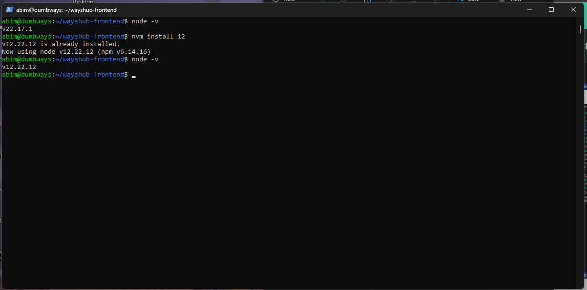

# NodeJS  
Clone Repository terlebih dahulu, dengan tekan tombol `<> CODE`, lalu salin urlnya.  

Jalankan command git clone dan paste urlnya  
`git clone https://github.com/dumbwaysdev/wayshub-frontend.git`  
Lalu bisa dicek isi direktorinya.  
  
Nyalakan ufw port 3000 nya, untuk kita bisa menjalakannya di port 3000,  
`sudo ufw allow 3000`  
lalu cek statusnya  
`sudo ufw status`  
  
Periksa versi node kita, jika versinya terlalu tinggi, maka kita bisa menurunkan versi kebawahnya.
Sesuai dengan tugasnya saya memakai node versi 12.

# Python  
- Deploy app menampilkan text nama kalian!  
- Berjalan di port 5000 & bisa dibuka melalui web
  
# Golang
- Deploy app menampilkan text "Golang geming!"  

Note : Semua app bisa diakses dengan UFW enabled (firewall menyala abangkuh 🔥🔥🔥)

