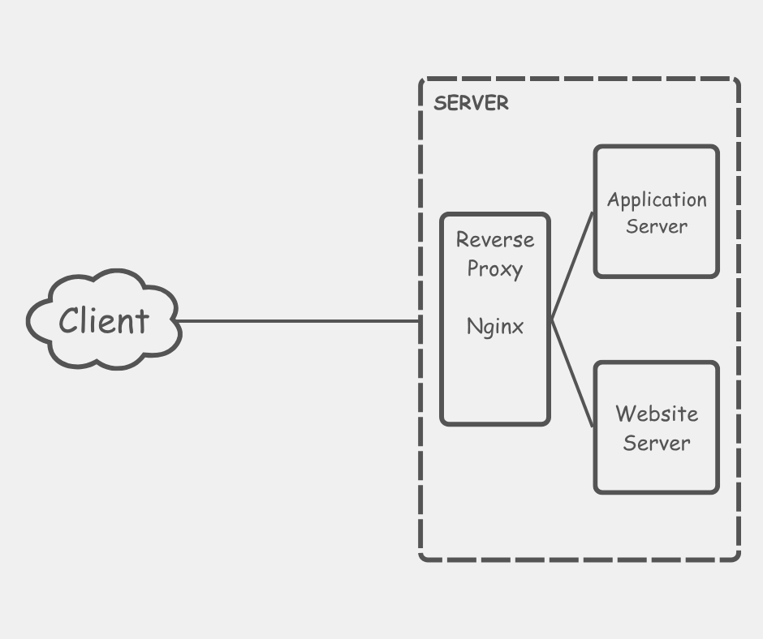
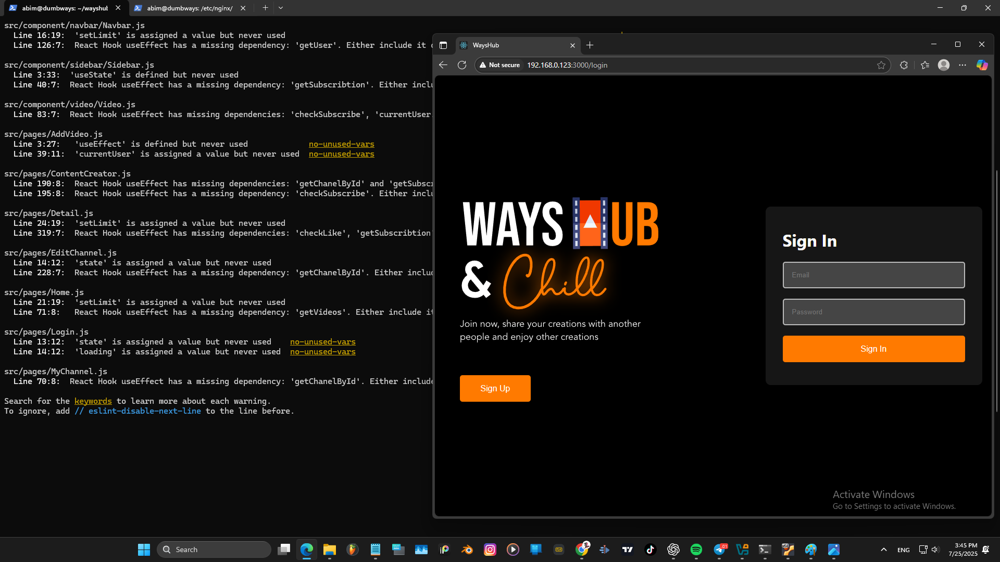
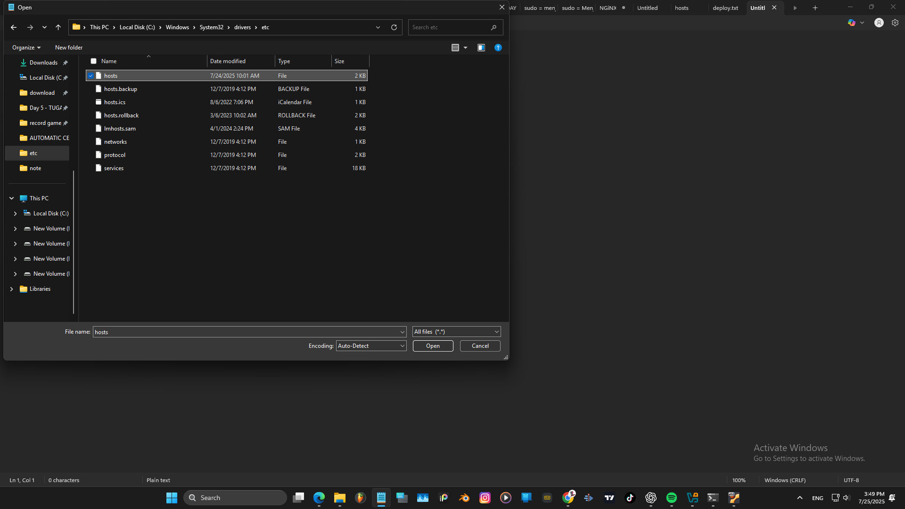

  
### Penjelasan

##  Reverse Proxy dengan nama domain yang disesualikan nama diri sendiri
Mebuka web yang sudah dideploy.  
  

Buka Notepad sebagai Admin.  
  

buka file host di  
`Local Disk (C:) > Windows > System > drivers > etc`  
   

Menambahkan configurasi  
`192.168.0.123 abimsyaefulloh.xyz`  
  

Buka tab baru diterminal, lalu buka direktori  
`cd /etc/nginx/`  
dan buka direktori  
`cd sites-enabled`  
buat file configurasi baru di **sites-enabled**  
`sudo nano wayshub-frontend.conf`  
  

Buat codingan berikut, untuk membuat nama server dan lokasi portnyad, lalu simpan filenya.   
  

Jalankan `sudo nginx -t` untuk mengecek configurasi kita sudah benar atau belum.  
Jalankan `sudo systemctl reload nginx` untuk mereset atau mereload config baru.  
Jalankan `sudo sytemctl status nginx` untuk mengecek nginx nya berjalan atau tidak.  
Terakhir kita buka abimsyaefulloh.xyz dibrowser kita.  
  
terlihat webnya bisa diakses menggunakan configurasi yang sudah dibuat sebelumnya.
